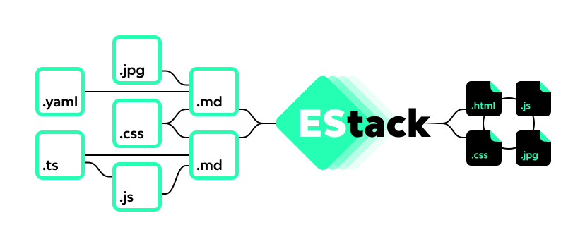

**EStack simplifies development of static websites and distribution of ES modules**, with EStack you can:

1. **Create static sites**: EStack will process your Html and Markdown files for extraction for asset detection and template management.
2. **Create css bundles**: EStack processes css files with [Stylis](https://stylis.js.org/) a modern, light and fast alternative to Postcss.
3. **Create ES module bundles**: EStack processes JavaScript and TypeScript files thanks to Rollup.
4. **Use development server**: EStack creates a development server when working with the `--server` flag, which combined with the`--watch` flag, will activate the livereload mode.
5. **Condition exports**: EStack has several flags that allow a conditional export, such as including external NPM files or Minify.
6. **Export using expressions**: EStack will read the files using expressions, for example the expression `src/**/*.{html,markdown}` will configure EStack to process all existing html and markdown files in the `src/` directory.

## CLI

### Console boot

```
estack [src] [dest]
```

Where:

- `src` : Asset source directory, you can point to one or multiple files, either directly or using expressions.
- `dest` : Destination of the processed files.

### Flags

`--watch` : Restart the build process only to the affected files, this can be combined with `--server`, to activate livereload mode.

`--server` : Create a local server that points to `dest`.

`--port <number>` : `Default 8000`, defines the search port for the server.

`--proxy <url>` : All requests not resolved locally will be sent to the proxy.

`--sourcemap` : Enables the generation of the `js.map` files of JavaScript-type assets.

`--minify` : Minify JavaScript files.

`--jsx <string> --jsxFragment <string>` : Default `h` y `Fragment`, allows customizing support for JSX.

`--sizes` : It shows by console the size of the total files, Gzip and Brotli type JavaScript.

## How to create static sites?

Static site management is enabled by defining in the input expression (`src`),`html` or `md` extension files, eg:

```bash
estack src/**/*.html public # processes only .html files and
                            # all the assets that they demand
                            # the processed files are stored in public

estack src/**/*.{html,md} public # processes files with extension
                                 # html and md, with all the assets that they demand
                                 # processed files are stored in public
```

### Asset resolution

Collecting assets from the Html and Markdown files is done using the CSS selector expression `[src]` or `[href]`, eg:

**index.html**

```html
<link rel="stylesheet" href="my-css.css" />

<h1>my html document</h1>


<script type="module" src="my-page.js"></script>
```

**dest/index.html**: Html output example.

```html
<link rel="stylesheet" href="./my-css.css" />

<h1>my html document</h1>


<script type="module" src="./my-page.js"></script>
```

> If the origin of the local assets is not resolved, the url will keep the original value.

### Template system

EStack allows you to have a simple and scalable template system based on Markdown, [Liquidjs](https://liquidjs.com/) and header metadata snippets in YAML format, ej:

**index.html**

```html
---
title: my page
---

<html>
  <head>
    <title>{{page.title}}</title>
  </head>
</html>
```

**index.md**

```markdown
---
title: my page
---

## {{page.title}}
```

> The `page` property allows access to everything declared in the metadata fragment.

### Writing rule

**Exported assets must have a unique name**, eg:

**Input directory**.

```bash
/src
  /components
    /my-componet-1
      my-component-1.js
      my-component-1.md
    /my-componet-2
      my-component-2.js
      my-component-2.md
  index.html
  blog.html
```

If you run the command `npm stack src/**/*.{html,md} dest`, it gives an approximate result of:

```bash
/dest
  my-component-1.js
  my-component-2.js
  my-component-1.html
  my-component-2.html
  index.html
  blog.html
```

> To customize the destination directory name or directory there are special metadata properties `folder` and`name`.

### Special metadata properties

#### folder y name

The `folder` property allows you to define the destination folder for the document that declares it and the`name` property allows you to define the name of the document, eg:

```yaml
folder: animals
name: cat
```

If your file is named `my-cat.html`, it will be written to the destination as`animals/cat.html`, **The `name` property can be used for cross-page referencing**

#### template

It allows defining the document as a master template, so it will not be written. ej:

**template.html**

```html
---
title: i am layout
template: default
---

<h1>{{layout.title}}</h1>
<h1>{{page.title}}</h1>

<div>
  {{page.content}}
</div>
```

> The default property defines this template as the default for all pages that do not declare their layout.

**page.html**

```html
---
title: i am page
---

<p>lorem...</p>
```

**dest/page.html**

```html
<h1>i am layout</h1>
<h1>i am page</h1>
<div>
  <p>lorem...</p>
</div>
```

**Nota:** The template property can be an alias other than `default`, ej:

```yaml
layout: template-users
```

#### pages

**This property can only be accessed by templates** and allows access to all pages processed, be it metadata and content, eg:

```html
---
template: default
singlePage: index
---

<h1>page links</h1>

<nav>
  
  <a href="{{item.link}}">
    {{item.title}}
  </a>
  
</nav>
```

#### pkg

It allows access to all the data contained in the package.json.

### files

It allows generating an import alias as a page variable, eg:

```markdown
---
files:
  cover: ./my-image.jpg
---

## image


```

**The advantage of this is that the assets are stored in the metadata so that it can be used**

### fetch

It allows to generate a request at the moment at the moment of the build, eg:

```html
---
fetch:
  config: ./config.yaml
  todos: https://jsonplaceholder.typicode.com/todos
---

<h1>{{fetch.config.title}}</h1>


<div>
  <h3>{{todo.title}}</h3>
</div>

```

**Fetch** creates a dependency relationship with local files, so any change generates a rewriting of the document that uses it.

## Css con Stylis

The css files can be used as modules within Rollup or as Html or Markdow file Assets, these are processed thanks to [Stylis](https://stylis.js.org/).

### @import

the configuration allows importing local modules or from `node_modules`, the resolution of this must be pointed to the file eg:

```css
@import "./my-css.css"; /**local**/
@import "my-package/my-css.css"; /**node_module**/
```

### @use

This allows applying a selection on the selectors and keyframes imported by the css, eg:

```css
@use ".button-circle";
@import "my-package-1/my-buttons";
@import "my-package-2/my-buttons";

.button-circle {
  color: black;
}
```

Any selector other than `.button-circle` will be ignored but only from imports, in this case `my-package-1/my-buttons` and `my-package-2/my-buttons`.

Types of expressions for @use:

- `@use ".button"` : Any selector that starts with `.button`.
- `@use ".button-"` : Any selector that starts with `.button-`, eg: `.button-circle` y `button-alert`.
- `@use "button$"` : Selector only `button`

### CSS modules

You can export the css as **plain text** to be used within javacsript, eg:

```js
import style from "./my-css.css";
```

Ideal to be used inside the shadowDom
